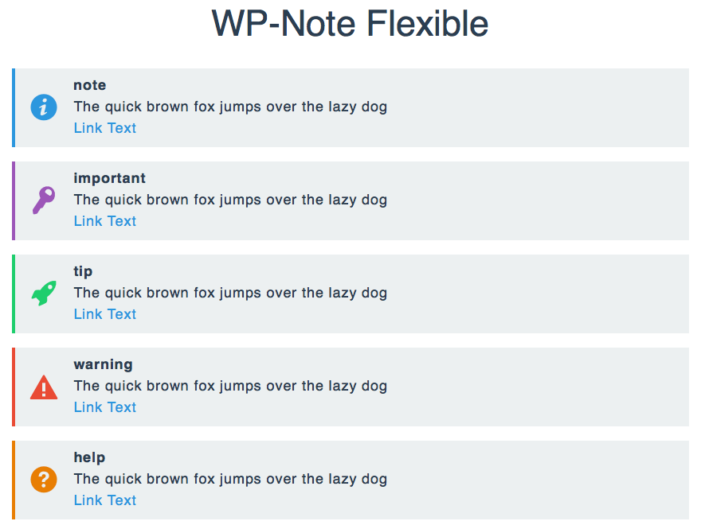

# WP-Note Flexible2

[WP-Note](http://wordpress.org/plugins/wp-note/) 互換の注釈機能を提供する WordPress プラグインです。

## 使い方

1. 投稿ページを表示します
2. 注釈にしたいテキストをショートコードで囲います

## ライセンス

* [GNU GENERAL PUBLIC LICENSE Version 2](LICENSE.txt)
